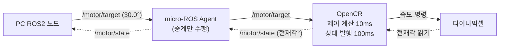

# LV2 Module 1 — OpenCR·다이나믹셀 통합
 

## 문제 1. 목표 입력과 응답 확인

### 1-1. 원격 수행 환경 구성

- 라즈베리파이 호스트명(`hostname`): **pa24**
- Ubuntu 버전(`cat /etc/os-release`): **Ubuntu 22.04.5 LTS**
- 아키텍처(`uname -m`): **aarch64**
- OpenCR 연결/사용 포트: **/dev/ttyACM0**
- SSH 접속 및 `dialout` 그룹 권한 확인 결과: ssh접속은 터미널에 `whoami` 명령어를 입력하여 **pa24**라는 값이 나왔고 `id -nG` 를 터미널창에 입력하여 **pa24 adm dialout cdrom floppy sudo audio dip video plugdev netdev lxd** 값을 출력 받아 dialout 그룹 권한 결과를 확인하였다.
- 근거 파일: [`results/환경확인.txt`](results/환경확인.txt) 

### 1-2. OpenCR 펌웨어 업로드

- 사용한 펌웨어: **직접 빌드 (`output/opencr_position_p.ino.bin`, 103KB, 프로그램 저장공간 13% 사용)**
- 업로드 성공 확인 근거(`CRC OK`, `[OK] Download` 등 출력): **CRC OK 9B81E2 9B81E2 0.003000 sec / [OK] Download**
- 업로드 이후 준비 상태 확인(`READY` 등, 이동 명령 없이 확인): **READY: s <Kp> <speed_deg_s|max> <angle_deg>; k/v/a set; s start; x stop. Newline.**
- 근거 파일: [`results/upload.log`](results/upload.log)

### 1-3. 목표 입력과 응답 기록 (실행 A)

- 모터 모델 / ID: **XM430_W210 / DXL_ID = 1**
- 게인(Kp 등, 사용한 예제 기준):  **0.5**
- 목표각(상대 목표각): **20°**
- 속도 상한: **15 deg/s**
- 사용 예제 이름(예: `opencr_position_p`): **opencr_position_p**

목표 변경 이후 5행 이상 기록:

|시간(s)|목표값(deg)|측정값(deg)|제어 출력(deg/s)|비고|
|---|---|---|---|---|
| 2.000 | 20.000 | 0.000 | 9.618 | 목표 변경 직후 |
| 2.500 | 20.000 | 4.043 | 8.244 | |
| 3.000 | 20.000 | 7.559 | 6.870 | |
| 3.500 | 20.000 | 10.459 | 4.122 | |
| 4.000 | 20.000 | 12.480 | 4.122 | |
| 7.201 | 20.000 | 18.633 | 0.000 | 이 시점부터 위치 정체 시작 | 
| 9.901 | 20.000 | 18.633 | 0.000 | `x` 입력 직전 (정체 유지 확인) |

- 종료 시 정지 확인 결과:**`x` 입력 → `STOP: user` 확인**
- 근거 파일: [`results/실행A.log`](results/실행A.log) 

### 1-4. 결과 설명

- 목표값 · 측정값 · 제어 출력의 구분 및 단위 정리: 
  - **목표값(`target_deg` )은 모터가 도달해야 할 상대 각도를 의미하며 단위는 `°(deg)`이다.** 
  -  **측정값(`position_deg`)은 엔코더로 읽은 현재 상대 각도로 단위는 `°(deg)`이다.** 
  -  **제어출력(`u_deg_s`)은 P 제어기가 계산해서 실제로 모터에 명령한 속도이고 단위는 `°/s(deg/s)`이다.**
- 실제 움직임에 대한 관찰 설명: t=2.0s~4.0s 구간에서 `error_deg`가 20.000→7.520으로 꾸준히 줄고 그에 비례해서 `u_deg_s`도 9.618→4.122로 같이 줄어들어 오차에 비례해서 속도가 줄어드는 P 제어 특성을 보인다. t=7.2s 이후 `position_deg`가 18.633°에서 멈추고 `u_deg_s`가 0.000으로 떨어진 채 `x`(t≈9.9s)까지 그대로 유지되어 목표 20°에 완전히 도달하지 못하고 정지하였다.

---

## 문제 2. 오차와 피드백 해석

|시점|t(s)|목표각|현재각|오차(목표각 − 현재각)|
|---|---|---|---|---|
|초기|2.0|20.000|0.000|20.000|
|중간|3.0|20.000|7.559|12.441|
|마지막|9.901|20.000|18.633|1.367|

- 오차 크기 변화 설명: **오차는 초기 20.000°에서 중간 12.441°, 마지막 1.367°로 시간에 따라 단조 감소했으며 오차가 클수록 감소폭이 크고(2.0~3.0s 구간 -7.559°) 오차가 작아질수록 감소폭이 완만해지는 전형적인 P 제어 응답을 보였다.**
- 위치 측정 센서 → OpenCR까지의 통신 경로 설명: **위치값은 다이나믹셀(XM430-W210) 내장 엔코더가 측정해 모터 내부 컨트롤러의 `PRESENT_POSITION` 레지스터에 저장하며 OpenCR이 매 제어 주기(10ms)마다 DXL 포트(`Serial3`, TTL 하프듀플렉스)를 통해 `Dynamixel Protocol 2.0`(1 Mbps)로 Read 패킷을 보내고 모터가 Status 패킷으로 응답하면 그 값을 틱 단위로 받아 각도로 변환해 사용한다.**
- 목표 +30°, 현재각 +35° 예시에서 오차 부호와 양의 Kp에 의한 보정 방향: **목표각 +30°, 현재각 +35°일 때 오차는 30−35=−5°로 음수이며 양의 Kp를 곱한 P 제어 출력도 함께 음수가 되어 모터에 음의 속도 명령이 전달되므로 모터는 각도를 줄이는 방향(35°→30° 쪽)으로 회전해 오차를 0으로 수렴시키는 음의 되먹임(negative feedback)이 작동한다.**

---

## 문제 3. P 게인 변경에 따른 응답 비교

### 3-1. 실행 A / B 공통 조건(목표각, 속도 상한, 부하, 측정 주기, 시작 자세, 이동 여유)

- 목표각: **20 deg** (상대 목표각, 동일)
- 속도 상한: **15 deg/s** (동일, `v_limit_deg_s`)
- 부하: **무부하** (외부 부하 없음, 동일)
- 측정 주기: **10Hz 동일** (시리얼 로그 출력 주기)
- 시작 자세: **0 deg** (두 실행 모두 `START: current position = 0`)
- 이동 여유: **동일** (0°→20° 회전 경로에 물리적 걸림 없음)

| 항목 | 실행 A | 실행 B |
|---|---|---|
| Kp 설정 | 0.5 (Ki=0, Kd=0) | 1.0 (Ki=0, Kd=0) |

### 3-2. 같은 경과 시간에서의 현재각

| 시각(t) | A position_deg | A error_deg | B position_deg | B error_deg |
|---|---|---|---|---|
| 2.0s | 0.000 | 20.000 | 0.000 | 20.000 |
| 2.5s | 4.043 | 15.957 | 5.537 | 14.463 |
| 3.0s | 7.559 | 12.441 | 11.426 | 8.574 |
| 3.5s | 10.459 | 9.541 | 14.854 | 5.146 |
| 4.0s | 12.480 | 7.520 | 16.875 | 3.125 |
| 5.2s | 15.908 | 4.092 | 18.984 | 1.016 |
| 7.2s (정체) | 18.633 | 1.367 | 19.336 | 0.664 |

### 3-3. 목표 초과 여부

두 실행 모두 전 구간에서 목표각 20°를 초과한 적이 없다. 실행 A는 최대 18.633°까지, 실행 B는 최대 19.336°까지 도달한 뒤 각자 정체했으며 어느 쪽도 오버슈트를 보이지 않았다.

### 3-4. 두 결과 차이에 대한 근거 있는 해석

같은 경과 시간(t=2.0~7.2s)마다 실행 B의 현재각이 실행 A보다 항상 더 크게 나타났는데 이는 Kp가 커질수록 같은 오차에서 계산되는 구동 명령 `p_deg_s = Kp × error`가 그만큼 커지기 때문이다. 시각별 이동량 차이(B−A)는 t=2.5s에 1.494°였다가 t=3.0~4.0s 구간에서 3.9~4.4°로 가장 크게 벌어진 뒤 양쪽이 각자의 정체 각도에 가까워지면서 t=7.2s에는 0.703°로 다시 줄어들었다. 두 실행 모두 20°에 끝내 도달하지 못하고 정체됐는데(A는 잔류오차 1.367°, B는 0.664°) 이는 Ki=0이라 정상상태 오차를 누적 보정할 수단이 없어서 발생한 공통 한계이며 Kp를 올려도 정체 자체는 해소되지 않고 정체되는 위치만 목표에 더 가까워졌을 뿐이다. 또한 실행 B는 정체 이후에도 t=5.8, 6.0, 9.7, 11.3, 11.9s에 짧은 보정 펄스(u_deg_s=1.374)가 반복 발생한 반면, 실행 A는 로그 마지막 시점(t=7.2s)까지 이런 보정 없이 그대로 정체된 상태를 유지했는데 이는 Kp가 클수록 데드밴드 경계 부근에서 미세한 진동성 보정이 더 자주 나타남을 보여준다.

같은 경과 시간마다 실행 B의 현재각이 실행 A보다 항상 컸는데(예: t=3.0s에 B 11.426° vs A 7.559°) 이는 Kp가 클수록 같은 오차에서 구동 명령 `p_deg_s = Kp × error`가 커지기 때문이다. 두 실행 모두 20°에 못 미치고 정체했는데 로그의 `u_deg_s`가 1.374 deg/s의 배수로만 나타나고 정체 시점의 `p_deg_s`(A 0.684, B 0.664)가 약 0.69 deg/s 미만일 때 `u_deg_s`가 0이 되는 것으로 보아 이 값 미만의 명령은 모터에 전달되지 않는 것으로 판단된다. 따라서 정체 오차는 Kp에 반비례하여 Kp=0.5인 A는 1.367°, Kp=1.0인 B는 0.664°에서 멈췄고 Kp를 올려도 정체 자체는 없어지지 않고 정체 위치만 목표에 가까워졌다. 오차를 누적해 이 문턱을 넘겨 주는 I항이 없다(Ki=0)는 점도 잔류 오차가 남은 이유이다. 실행 B에서 정체 후 t=5.8, 6.0, 9.7, 11.3, 11.9s에 나타난 `u_deg_s`=1.374 펄스는 측정각이 19.336°↔19.248°로 한 눈금 흔들려 `p_deg_s`가 0.752가 되어 문턱을 넘긴 순간과 일치한다.

### 3-5. 변경한 게인이 OpenCR 위치 제어 게인인지 / 다이나믹셀 내부 게인인지 구분

이번에 바꾼 Kp는 OpenCR 펌웨어 자체에 구현된 P 제어기의 게인이며 휠 모드로 다이나믹셀을 구동하면서 OpenCR이 직접 오차를 계산해 속도 명령을 내리는 구조이므로 다이나믹셀 내장 포지션 제어기(Position PID)의 게인과는 별개다.

### 3-6. I항 역할

I항(적분항)은 오차를 시간에 걸쳐 누적해 P항만으로는 해소되지 않는 작은 잔류(정상상태) 오차를 서서히 제거하는 역할을 한다.

### 3-7. D항 역할

D항(미분항)은 오차의 변화율(속도)에 반응해 응답이 목표에 급히 다가갈 때 제동을 걸어 오버슈트와 진동을 억제하는 역할을 한다.

근거 파일: [`results/실행A.log`](results/실행A.log) , [`results/실행B.log`](results/실행B.log) 

---

## 문제 4. 제어와 통신의 역할 해석
>가상 기록 기반이며 실측 결과가 아님

### 4-1. 구조도 (PC ROS2 노드 ↔ micro-ROS Agent ↔ OpenCR ↔ 다이나믹셀, 목표 전달·측정값 반환 방향 표시):

>실선(→)은 목표 전달 방향이고 점선(⇢)은 측정값 반환 방향입니다.

### 4-2. 목표/상태를 보내고 받는 주체 설명:
  목표(`/motor/target`)는 PC ROS2 노드가 발행(publish)하고 OpenCR이 구독(subscribe)해서 받는다. 상태(`/motor/state`)는 반대로 OpenCR이 다이나믹셀에서 읽은 현재각을 100ms마다 발행하고 PC ROS2 노드가 구독해서 받는다. micro-ROS Agent는 PC와 OpenCR 사이의 메시지를 중계할 뿐 목표나 상태를 만들거나 판단하지 않으며 다이나믹셀은 OpenCR의 명령을 수행하고 현재 각도를 제공하는 구동·센서 장치이다.

### 4-3.  상태 발행 한 주기(100ms) 동안 제어 계산(10ms 주기) 횟수 계산:
  100ms ÷ 10ms = **10회**. 상태 발행 한 주기 동안 제어 계산이 10번 수행된다. 제어는 짧은 주기로 빠르게 돌려야 안정적이고 통신은 그보다 느린 주기로 보내도 충분하며 부담도 적기 때문에 두 주기를 다르게 둔다.

### 4-4. 통신 단절 시 오래된 명령 처리 정책과 이유:
  **정책**: 목표 명령에 유효 시간(timeout)을 두고 그 시간 안에 새 목표가 도착하지 않으면 마지막 목표(30.0°)를 오래된 명령으로 간주해 폐기하고 모터를 정지(또는 현재 위치 유지)시킨다. 통신이 복구된 뒤에도 옛 명령을 재실행하지 않고 새 목표가 올 때까지 대기한다.
  **이유**: 통신이 끊기면 OpenCR은 PC 쪽 상황을 알 수 없는데 낡은 목표를 계속 추종하면 이미 취소되었거나 상황이 바뀐 명령으로 모터가 움직여 사람이나 장비가 위험해질 수 있고 PC도 모터 상태를 알 수 없기 때문이다.
---

## 결과 파일 위치

|경로|내용|
|---|---|
|[`results/환경확인.txt`](results/환경확인.txt)|호스트명, Ubuntu 버전, 아키텍처, 사용 포트|
|[`results/upload.log`](results/upload.log) |업로드 수행 및 성공 확인 출력|
|[`results/실행A.log`](results/실행A.log) |목표 변경 이후 측정값 5행 이상 + 정지 확인|
|[`results/실행B.log`](results/실행B.log) |목표 변경 이후 측정값 5행 이상 + 정지 확인|